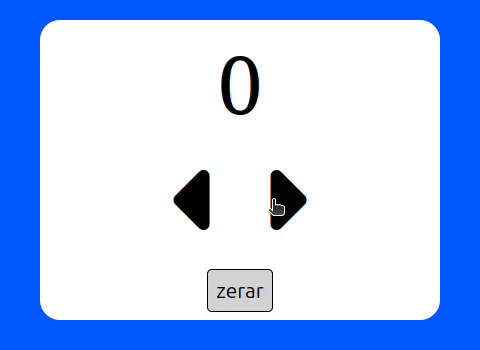

# Contador

Criar um contador com html, css e javascript que tenha:

+ Uma área que mostre o número.
+ Um botão que adiciona um número.
+ Um botão que tira um número.
+ Um botão que zera o contador.
