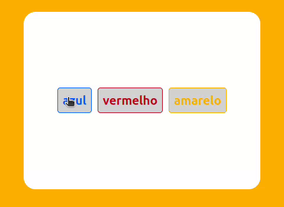

# Altera cor de fundo

Criar um site com 3 botões:

+ Um botão que altera a cor de fundo para verde.
+ Um botão que altera a cor de fundo para azul.
+ Um botão que altera a cor de fundo para amarelo.

## Demo
[Demo](https://dsordes37.github.io/exercicios_dom/002_altera_fundo)

## Home
[Home](../readme.md)