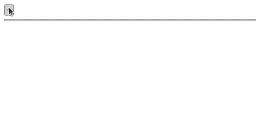

# Menu acordeon

## O site deve possuir:

+ Um menu com 1 item.
+ o item deve ter um texto de 3 linhas.
+ Um botão que faça o item abrir e fechar.

## Demo
[Demo](https://dsordes37.github.io/exercicios_dom/003_menu_acordeon)