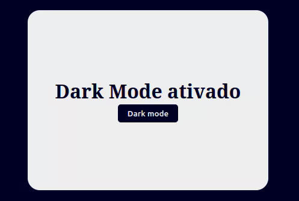

# DarkMode button

O site deve possuir:

+ Um botão que ao ser clicado mude a paleta de cores do site para uma paleta escura.
+ Ao ser clicado novamente o botão deve retornar o site às cores originais.

## Demo
[Demo](https://dsordes37.github.io/exercicios_dom/009_darkmode)

## Home
[Home](../readme.md)