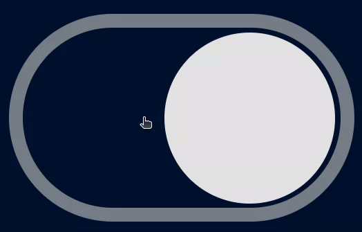

# Toggle button

O site deve conter:

+ Um toggle button que ao ser clicado esteja alinhado a direita.
+ Ao ser clicado novamente ele deve voltar à posição inicial. 

## Demo
[Demo](https://dsordes37.github.io/exercicios_dom/010_toggle)

## Home
[Home](../readme.md)